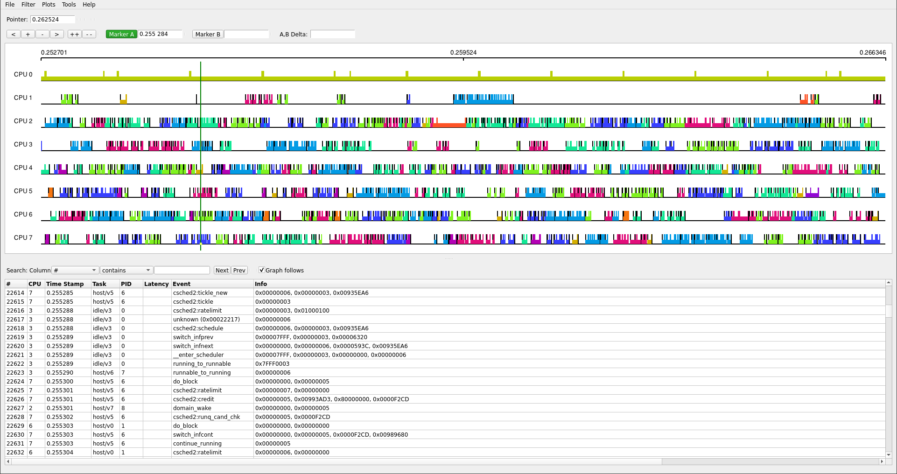

# KernelShark XenTrace plugin in RUST (WIP) [](https://github.com/giuseppe998e/kernelshark-xentrace-plugin-rs/tags)

<p>
    
    This plugin allows you to view the traces generated by XenTrace on KernelShark-v2.<br>
    This is a <b>Rust implementation</b> of a project for the final three-year degree exam at the University of Turin.
</p>
<br>
<br>
<br>
<br>
<br>

## Building

### Dependencies

- `rust` (v1.56.1+)

### Testing/Development

```shell
$ git clone https://github.com/giuseppe998e/kernelshark-xentrace-plugin-rs.git
$ cd kernelshark-xentrace-plugin-rs/
$ git checkout develop #opt
$ cargo build
```

You can find the plugin file into `target/debug/libkernelshark_xentrace_plugin.so`

### Optimized for usage

```shell
$ git clone https://github.com/giuseppe998e/kernelshark-xentrace-plugin-rs.git
$ cd kernelshark-xentrace-plugin-rs/
$ cargo build --release
```

You can find the plugin file into `target/release/libkernelshark_xentrace_plugin.so`

## Usage

```shell
$ export XENTRACE_CPUHZ=3.6G # Sets the CPU speed used (in (G)hz / (M)hz / (K)hz / hz )
$ kernelshark -p libkernelshark_xentrace_plugin.so trace.xen
```

**N.B.** The plugin uses a predefined value of `2.4G` as CPU frequency.

## License

This plugin is released under the `GNU Lesser General Public License v2.1 (or later)`.  
This plugin uses code from various projects:

- [LibC](https://github.com/rust-lang/libc) released under `MIT` ot `Apache-2.0`.
- [XenTrace-Parser-Rs](https://github.com/giuseppe998e/xentrace-parser-rs) released under the `LGPLv2.1`.
